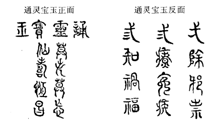
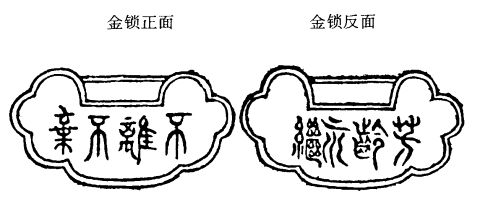

### 贾宝玉奇缘识金锁 薛宝钗巧合认通灵

话说宝玉和凤姐回家，见过众人，宝玉便回明贾母要秦钟上家垫之事，自己也有个伴读的朋友，正好发愤；又着实称赞秦钟的人品行事，最使人怜爱。凤姐又在一旁帮着说：「改日秦钟还来拜老祖宗哩。」说得贾母喜悦起来。凤姐又趁势请贾母后日过去看戏。贾母虽年高，却极有兴头。至后日，尤氏来请，遂携了王夫人、林黛玉、宝玉等过去看戏。至晌午，贾母便回来歇息了。王夫人本是好清净的，见贾母回来，也就回来了。然后凤姐坐了首席，尽欢至晚而罢。

却说宝玉送贾母回来，待贾母歇了中觉，竟欲还去看戏，又恐搅的秦氏等人不便，因想起宝钗近日在家养病，未去亲候，意欲去望他。若从上房后角门过去，又恐遇见别事缠绕，又恐遇他父亲，更为小妥①，宁可绕远路而去。当下众嬷嬷丫鬟伺候他换衣服，见不换，仍出二门去了；众雑嬷丫鬟只得跟随出来，还只当他去那边府中看戏。谁知到了穿堂，便向东向北绕厅后而去。偏顶头遇见了门下清客相公詹光、单聘仁二人走来[^1]，一见了宝玉，便都赶上来笑着，一个抱住腰[^2],一个携着手，都道：「我的菩萨哥儿！我说做了好梦呢，好容易遇见了你。」说着，请了安，又问好，又唠叨了半日，才走开。老嬷嬷叫住③，因问：「你二位爷是往老爷踉前来的不是？」他二人点头道：「老爷在梦坡斋小书房里歇中觉呢，不妨事的。」一面说，一面走了。

说的宝玉也笑了，于是转弯向北奔梨香院来。可巧银库房的总领名唤吴新登与仓上的头目名戴良，还有儿个管事的头目，共七个人，从账房里出来，一见宝玉，赶来都一齐垂手站立；独有一个买办，名唤钱华，因他多日未见宝玉，忙上来打千儿请宝玉的安[^3]，宝玉忙含笑拉他起来。众人都笑说：「前儿在一处看见二爷写的斗方儿[^4]，字法越发好了，多早晚赏我们几张贴贴。」宝玉笑道：「在那处看见了？」众人道：「好几处都有，都称赞的了不得，还和我们寻呢。」宝玉笑道：「不值什么，你们说给我的小么儿们就是了[^5]。」一面说，一面前走，众人待他过去，方都各自散了。

闲言少述，且说宝玉来至梨香院中，先入薛姨妈屋中来，见薛姨妈打点针黹与丫鬟们呢。宝玉忙请了安，薛姨妈一把拉住了他，抱入怀中笑说：「这么冷天，我的儿！难为你想着来，快上炕来坐着罢。」命人：「倒滚滾的茶来。」宝玉因问：「哥哥不在家？」薛姨妈叹道；「他是没笼头的马，天天逛不了，那里肯在家一日？」宝玉道：「姐姐可大安了？」薛姨妈道：「可是呢，你前儿又想着打发人来瞧他。他在里间不是，你去瞧。他那里比这里暖和，你那里坐着，我收拾收拾就进来和你说话儿。」

宝玉听了，忙下炕来至里间门前，只见吊着半旧的红紬软帘。宝玉掀帘一步进去，先就看见宝钗坐在炕上作针线，头上挽着黑漆油光的䰖儿，蜜合色的棉袄[^6]，玫瑰紫二色金银鼠比肩褂，葱黄绫子棉裙，一色儿半新不旧，看去不觉奢华。唇不点而红，眉不画而翠，脸若银盆[^7]，眼如水杏。罕言寡语，人谓装愚；安分随时，自云「守拙」[^8]。

宝玉一面看，一靣问：「姐姐可大愈了？」宝钗抬头只见宝玉进来，连忙起身含笑答道：「已经大好了，多谢记挂着。」说着，让他在炕沿上坐了，即令莺儿：「倒茶来。」一面又问老太太姨娘安，又问别的姊妹们好；一面看宝玉头上戴着累丝嵌宝紫金冠[^9]，额上勒着二龙捧珠金抹额，身上穿着秋香色立蟒白狐腋箭袖[^10]，系着五色蝴蝶鸾绦[^11]，项上挂着长命锁、记名符，另外有那一块落草时衔下来的宝玉。宝钗因笑说道：「成日家说你的这玉，究竟未曾细细的赏鉴，我今儿倒要瞧瞧。」说着便挪近前来。宝玉亦凑上去，从项上摘了下来，递在宝钗手内。宝钗托在掌上，只见大如雀卵，灿若明霞，莹润如酥，五色花纹缠护③。看官们须知道，这就是大荒山中青埂峰下的那块顽石幻相，后人曾有诗嘲云：

女娲炼石已荒唐，又向荒唐演大荒[^12]。先去幽灵真境界，幻来新就臭皮囊[^13]，好知运败金无彩，堪叹时乖玉不光[^14]。白骨如山忘姓氏，无非公子与红妆[^15]。

那顽石亦曾记下他这幻相并癞僧所镌的篆文，今亦按图画于后，但其真体最小，方从胎中小儿口中衔下。今若按其体画，恐字迹过于微细，使观者大废眼光，亦非畅事。故按其形式，无非略展放些，使观者便于灯下醉中可阅。今注明此故，方不至以胎中之儿口有多大，怎得衔此狼犺蠢大之物为谤[^16]。

|------------------|------------------|
| 通灵宝玉正面图式 | 通灵宝玉反面图式 |
|------------------|------------------|
|   玉宝灵通       |                  |
|   莫失莫忘       |    一除邪崇      |
|   仙寿恒昌       |    二疗冤疾      |
|                  |    三知祸福      |
|==================|==================|
{: .hide.table}

宝钗看毕，又从先翻过正面来细看，口里念道：「莫失莫忘，仙寿恒昌。」念了两遍，乃回头向莺儿笑道：「你不去倒荼，也在这里发呆作什么？」莺儿嘻嘻的笑道：「我听这两句话，倒象和姑娘项圈上的两句话是一对儿。」宝玉听了，忙笑道：「原来姐姐那项圈上也有八个字？我也赏鉴赏鉴。」宝钗道：「你别听他的话，没有什么字。」宝玉央道：「好姐姐，你怎么瞧我的呢！」宝钗被他缠不过，因说道：「也是个人给了两句吉利话儿，錾上了，所以天天带着；不然沉甸甸的，有什么趣儿？」一面说，一面解了排扣，从里面大红袄上将那珠宝晶莹、黄金灿烂的璎珞摘将出来。宝卫忙托着锁看时，果然一面有四个字，两面八个字，共成两句吉谶[^17]，亦曾按式画下形相：

|----------|----------|
| 金锁正面 | 金锁反面 |
|----------|----------|
| 不离不弃 | 芳龄永继 |
|==========|==========|
{: .hide.table}

宝玉看了，也念了两遍，又念自己的两遍，因笑问：「姐姐，这八个字倒与我的是一对儿。」莺儿笑道：「是个癩头和尚送的，他说必须錾在金器上……」宝钗不待他说完，便嗔他不去倒荼，一面又问宝玉从那里来。

宝玉此时与宝钗就近，只闻一阵阵的香气，不知是何气味，遂问：「姐姐熏的是何香？我竟从未闻过这味儿。」宝钗笑道：「我最怕熏香，好好的衣服，熏的烟火气的？」宝玉道：「既如此是什么香？」宝钗想了一想，说：「是了，是我早起吃了冷香丸的香气。」宝玉笑道：「什么『冷香丸』，这么好闻？好姐姐，给我一丸尝尝。」宝钗笑道：「又混闹了，一个丸药也是混吃的？」

一语未了，忽听外面人说：「林姑娘来了。」话犹未了，林黛玉已摇摇摆摆的来了，一见宝玉，便笑道：「哎哟！我来的不巧了。」宝玉等忙起身让坐，宝钗因笑道：「这话怎么说。」黛玉道：「早知他来，我就不来了。」宝钗道：「我不解这意？」黛玉笑道：「要来时一齐来，要不来一个也不来：今儿他来，明儿我来，如此间错开了来，岂不天天有人来了？也不至太冷落，也不至太热闹。姐姐如何不解这意思？」

宝玉因见他外面罩着大红羽缎对襟褂子[^18]，因问：「下雪了么？」地下婆子们说：「下了这半日了。」宝玉道：「取了我的斗篷来。」黛玉便笑道：「是不是？我来了他就该去了。」宝玉道：「我何曾说要去？不过拿来预备着。」宝玉的奶母李嬷嬷因说道：「天又下雪，也要看早晚的[^19]，就在这里和姐姐妹妹一处玩玩罢。姨妈那里摆茶果呢。我叫丫头去取了斗篷来，说给小么儿们散了罢。」宝玉应了。李嬷嬷出来，命小厮们：「都散了。」

这里薛姨妈已摆了几样细巧茶果，留他们吃茶。宝玉因夸前日在那边府里珍大嫂子的好鹅掌鸭信[^20]。薛姨妈连忙把自己糟的取来与他尝[^21]。宝玉笑道：「这个须就酒方好。」薛姨妈便命人灌了上等的酒来。李嬷嬷便上来道：「姨太太，酒倒罢了。」宝玉笑央道：「妈妈，我只吃一杯。」李妈道：「不中用，当着老太太、太太，那怕你吃一坛呢。想那日我眼错不见一会[^22]，不知是那个没调教的[^23]，只图讨你的好，给了你一口酒吃，葬送得我挨了两日的骂。姨太太不知他性子又可恶，吃了酒更弄性。有一日老太太高兴，又尽着他吃，什么日子又不许他吃，何苦我白赔在里面？」薛姨妈笑道：「老货，只管放心吃你的去！我也不许他吃多了。便是老太太问，有我呢。」一面命小丫头：「来，让你奶奶去也吃杯搪搪寒气。」那李嬷嬷听如此说，只得且和众人吃酒去。这里宝玉又说：「不必烫暖了，我只爱吃冷的。」薛姨妈道：「这可使不得，吃了冷酒，写字手打颤儿。」宝钗笑道：「宝兄弟，亏你每日家杂学旁收的[^24]，难道就不知道酒性最热，若热吃下去，发散的就快；若冷吃下去，便凝结在内，五脏去暧他，岂不受害？从此还不改了。快不要吃那冷的了。」宝玉听这话有情理，便放下冷的，令人烫来方饮。

黛玉磕着瓜子儿，只管抿着嘴笑。可巧黛玉的丫鬟雪雁走来与黛玉送小手炉，黛玉因含笑问他说：「谁叫你送来的？难为他费心，那里就冷死了我！」雪雁道：「紫鹃姐姐怕姑娘冷，叫我送来的。」黛玉一面接了，抱在怀中，笑道：「也亏你倒听他的话，我平曰和你说的，全当耳旁风？怎么他说了你就依，比圣旨还快些！」宝玉听这话，知是黛玉借此奚落他，也无回复之词，只嘻嘻的笑一阵罢了。宝钗素知黛玉是如此惯了的，也不去睬他。薛姨妈因道：「你素日身子单弱，禁不得冷的，他们记挂着你倒不好？」黛玉笑道：「姨妈不知道。幸亏是姨妈这里，倘或在别人家，岂不要恼的？难道看得人家连个手炉也没有？巴巴儿的从家里送个手炉来。不说丫头们太小心，还只当我素日是这等轻狂惯了呢。」薛姨妈道：「你是个多心的，有这样想，我就没有这些心。」

说话时，宝玉已是三杯过去了。李嬷嬷又上来拦阻。宝玉正在个心甜意洽之时，又兼姊妹们说说笑笑的，那里肯不吃？只得屈意央告：「好妈妈，我再吃两杯就不吃了。」李嬷嬷道：「你可仔细今儿老爷在家，提防着问你的书！」宝玉听了此话，便心中大不悦，慢慢的放下酒，垂了头。黛玉忙说：「扫了大家的兴！舅舅若叫你，只说姨妈留着呢。这个妈妈，他吃了酒，又拿我们来醒脾了[^25]。一面悄推宝玉，使他赌赌气；一面悄悄的咕哝说：「别理那老货！咱们只管乐咱们的。」那李妈也素知黛玉的，因说道：「林姐儿，你不要助着他了。你倒劝他，只怕他还听些。」林黛玉冷笑道：「我为什么助他？我也不犯着劝他。你这妈妈太小心了，往常老太太又给他酒吃，如今在姨妈这里多吃了一口，料也不妨事。必定姨妈这里是外人，不当在这里的，也未可知。」李嬷嬷听了，又是急，又是笑，说道：「真真这林姐儿，说出一句话来，比刀子还利害，我这话算什么！」宝钗也忍不住笑着把黛玉腮上一拧，说道：「真真的这个颦丫头的一张嘴，叫人恨又不是，喜欢又不是。」薛姨妈一面又说：「别怕，别怕，我的儿！来了这里，没好的你吃，别把这点子东西吓的存在心里，倒叫我不安。只管放心吃，有我呢。越发吃了晚饭去，便醉了，就跟着我睡罢。」因命：「再烫些酒来，姨妈陪你吃两杯，可就吃饭罢。」宝玉听了，方又鼓起兴来，李嬷嬷因吩咐小丫头：「你们在这里小心着，我家去换了衣服就来。」悄悄的回姨太太：「别由他的性儿多吃了。」说着便家去了。

这里虽还有两三个婆子，都是不关痛痒的，见李嬷嬷走了，也都悄悄自寻方便去了。只剩两个小丫头，乐得讨宝玉的欢喜。幸而薛姨妈千哄万哄，只容他吃了几杯，就忙收过了。作了酸笋鸡皮汤，宝玉痛喝了几碗，又吃了半碗多碧粳粥[^26]，一时薛林二人也吃完了饭，又酽酽的喝了几碗茶[^27]。薛姨妈方放了心。雪雁等三四人，也吃了饭进来伺候。黛玉因问宝玉道：「你走不走？」宝玉乜斜倦眼道[^28]:「你要走我和你一同走。」黛玉听说，遂起身道：「咱们来了这一日，也该回去了说着，二人便告辞。

小丫失忙捧过斗笠来，宝玉便把头略低一低，叫他戴上，那丫头便将这大红猩毡斗笠一抖，才往宝玉头上一合，宝玉便说：「罢了，罢了！好蠢东西！你也轻些儿，难道没见别人戴过？让我自己戴罢。」黛玉站在炕沿上道：「过来，我与你戴罢。」宝玉忙近前来。黛玉用手轻轻笼住束发冠儿，将笠沿掖在抹额之上，将那一颗核桃大的绛绒簪缨扶起，顫巍巍露于笠外。整理已毕，端像了一会，说道：「好了，披上斗篷罢。」宝玉听了，接了斗蓬披上。薛姨妈忙道：「跟你们的妈妈都还没来呢，且略等等。」宝玉道：「我们倒去等他们，有丫头们跟着也够了。」薛姨妈不放心，吩咐两个妇女跟着送了他兄妹们去。

他二人道了扰，一径回至贾母房中。贾母尚未用晚饭，知是薛姨妈处来，更加喜欢。因见宝玉吃了酒，逢命他自回房中歇着，不许再出来了，因令人好生看待着。忽想起跟宝玉的人来，遂问众人：「李奶子怎么不见？」众人不敢直说他家去了，只说：「才进来的，想有事又出去了。」宝玉踉跄回顾道：「他比老太太还受用呢，问他作什么！没有他只怕我还多活两日。」一面说，一面来至自己卧室，只见笔墨在案。晴雯先接出来，笑道：「好好叫我研了墨，早起高兴，只写了三个字，丢下笔就走了，哄我等了这一天。快来给我写完了这些墨才罢！」宝玉方才想起早起的事来，因笑道：「我写的那三个字在那里呢？」晴雯笑道：「这个人可醉了。你头里过那府里去，嘱咐我贴在门斗儿上的，我生怕别人贴坏了，亲自爬高上梯，贴了半日，这会儿还冻得手僵呢。」宝玉笑道：「我忘了。你手冷，我替你握着。」便伸手携着晴雯的手，同看门斗上新写的三个字。

一时黛玉来了，宝玉笑道：「好昧妹④，你别撒谎，你看这三个字那一个好？」黛玉仰头看见是「绛芸轩」三字，笑道：「个个都好。怎么写得这样好法？明儿也替我写个匾。」宝玉笑道：「又哄我呢。」说着又问：「袭人姐姐呢？」晴雯向里间炕上努嘴。宝玉看时，只见袭人和衣睡着。宝玉笑道：「好，太睡早了些。」又问晴雯道：「今儿我那边吃早饭，有一碟儿豆腐皮的包子，我想着你爱吃，和珍大嫂子说了，只说我留着晚上吃，叫人送过来的。你可曾见么？」晴雯道：「快别提了。一送来我便知道是我的，偏才吃了饭，就搁在那里。后来李奶奶来了看见，说：『宝玉未必吃了，拿去给我孙子吃罢。』就叫人送了家去了。」正说着，茜雪捧上茶来，宝玉还让：「林妹妹吃茶。」众人笑道：「林姑娘早走了，还让呢。」

宝玉吃了半盏，忽又想起早晨的茶来，因问茜雪道：「早起斟了一碗枫露茶[^29]，我说过那茶是三四次后才出色的，这会子怎么又斟上这个茶来？」茜雪道：「我原是留着的，那会子李奶奶来了，吃了去。」宝玉听了，将手中杯子顺手往地下一掷，豁琅一声，打个粉碎，泼了茜雪一裙子。又跳起来问着茜雪道：「他是你那一门子的『奶奶』，你们这样孝敬他？不过是我小时候吃过他几日奶罢了，如今惯的比袓宗还大，撵了出去大家干净！」说着立刻便要去回贾母撵他乳母。

原来袭人实未睡着，不过是故意装睡，引宝玉来怄他玩耍[^30]，先闻得说字问包子，也还可以不必起来，后来摔了茶钟，动了气，遂连忙起来解释劝阻。早有贾母遣人来问：「是怎么了？」袭人忙道：「我才倒茶来，被雪滑倒了，失手砸了钟子。」一面又劝宝玉道：「你立意要撵他也好，我们都愿意出去，不如趁势连我们一齐撵了，我们也好，你也不愁没有好的来伏侍你。」宝玉听了，方无言语，被袭人等挟至炕上，脱了衣裳。不知宝玉口内还说些什么，只觉口齿缠绵，眉眼愈加饧涩，忙伏侍他睡下。袭人摘下那「通灵宝玉」来，用手帕包好，塞在褥子下，次日带时，便冰不着脖子。那宝玉到枕就睡着了。彼时李嬷嬷等已进来了，听见醉了，也就不敢上前，只悄悄的打听睡了，方放心散去。

次日醒来，就有人回：「那边小蓉大爷带了秦钟来拜。」宝玉忙接出去，领了拜见贾母。贾母见秦钟形容标致，举止温柔，堪陪宝玉读书，心中十分欢喜，便留茶留饭，又命人带去见王夫人等。众人因爱秦氏，见了秦钟是这样人品，也都欢喜，临去时，都有表礼。贾母又与了一个荷包并一个金魁星[^31]，取「文星和合」之意。又嘱咐他道：「你家住的远，或一时寒热不便，只管住在我这里。只和你宝叔在一处，别跟着那不长进的东西们学。」秦钟一一的答应，回家禀知他父亲。

他父亲秦邦业现任营缮郎[^32]，年近七旬，夫人早亡。因当年无儿女，便向养生堂抱了一个儿子并一个女儿[^33]，谁知儿子又死了，只剩女儿，小名唤可儿。长大时，生得形容袅娜，性格风流，因素与贾家有些瓜葛，故结了亲。秦邦业五旬之上方得了秦钟，因去岁业师回南，在家温习旧课，正要与贾亲家商议附往他家塾中去；可巧遇见宝玉这个机会，又知贾家塾中司塾的乃贾代儒，现今之老儒，秦钟此去，可望学业进益，从此成名，因十分喜悦。只是宦囊羞涩[^34]，那边都是一双富贵眼睛，少了拿不出来；儿子的终身大事，说不得东并西凑，恭恭敬敬封了二十四两贽见礼[^35]，带来秦钟到代儒家来拜见，然后听宝玉拣的好日子，一同入塾。塾中闹事如何，下回分解。

校记
------

*[①]: 「更为不妥」，「不妥」原作「不安」，与己卯、稿本同，这里从甲戌、庚辰、戚序本、王本和乙本改。
*[②]: 「老嬷嬤叫住」，「老嬷嬷」原作「老嬷」，与甲戍本、王本同，这里从己卯、庚辰、戚序、列本和乙本增一「嬤」字。
*[③]: 「莹润如酥，五色花纹缠护」，原作「莹润如五色酥，花纹缠护」，这里从脂评诸本、稿本及乙本改。
*[④]: 「好妹妹」，原作「好姐姐」，这里从脂评本、稿本、乙本和王本改。

注解
-----

[^1]: **清客相公**旧时富贵人家帮闲凑趣的门客，称为「清客」。相公：近似「老爷」、「先生」一类的称呼。清梁章钜《归田锁记》卷七「清客」：「都下清客最多，然亦须才品稍兼者方能自立。有编为十字令者曰：『一笔好字，二等才情，三斤酒量，四季衣服，五子围棋，六出昆曲，七字歪诗，八张马钓，九品头衔，十分和气。』」
[^2]: **抱腰**近人王瀣批云：「抱腰系清制，于此一见。」
[^3]: **打千儿**清代满族男子见人通行之礼，右手下垂，左膝前屈，上身微俯，行半跪礼。
[^4]: **斗方儿**门屏隔扇上贴的一种方形纸块，一二尺见方，以四角为上下左右，上书吉语。也指一般方形诗笺画页。
[^5]: **小么儿**小厮，小听差。
[^6]: **蜜合色**染色之一种。清李斗《扬州画舫录》卷一：「浅黄白色曰蜜合。」
[^7]: **银盆**本指明月，借以形容人颜面白净。《金瓶梅》第九回：「小字叫做月娘，生的面若银盆，眼如杏子。」
[^8]: **守拙**本为廉辞。拙：愚笨，拙于应世；守拙：意即安于自己的笨拙，不以巧伪与世周旋。晋陶渊明《归田园居》诗之一：「开荒南野际，守拙归田园。」这里指宝钗的一种处世态度。
[^9]: **累丝**累：连缀的意思。这里指以金拉丝再连缀成冠。
[^10]: **秋香色立蟒白狐腋箭抽**秋香色：黄色之一种。《清史稿・舆服二》载，雍正二年规定：「官员军民服色有黑狐皮、秋香色、米色、香色及鞍辔用米色、秋香色者，于定例外，加罪议处。」立蟒：妆缎之一，因织有蟒形花饰，故称蟒缎。又因蟒饰的不同，因之有时只称蟒的形状，而不用「缎」字。白狐腋：毛皮名称。《增韵》：「左右肘胁之间曰腋。」狐腋之毛色纯白，集以为裘，最为轻暖，是一种名贵皮毛。
[^11]: **五色蝴蝶鸾绦**绣有五色蝴蝶纹样的腰带。清李渔《闲情偶奇》卷七：「束腰之带，俗呼鸾绦。」
[^12]: **「女娲炼石」二句**荒唐：前一「荒唐」，是虚妄不可信的意思；后一「荒唐」，是漫无边际的意思，指荒唐的人世间。演：演说，发挥推演其义；演大荒：即演说大荒山顽石的故事。
[^13]: **「幻来」句**就：成就，形成。臭皮囊：指人的躯壳。旧时佛道信徒，厌恶人的肉体，以为其中藏有涕、痰，粪尿等污秽之物，故云。纯阳真君《了三得一经》：「竟将五官六腑，败坏于臭皮蠹之中。」句意谓頑石的原貌巳经失掉，幻化为一个毫无作为的人。
[^14]: **「好知」二句**好知：须知。金无彩：《桃花扇・哭主》：「一个候死的囚徒，登时上了青天。这叫做『运去黄金减价，时来顽石生光。』」金：指金锁。暗指宝钗。甲戌本脂批：「又夹入宝钗，不是虛图对的工。」或后半部原稿有宝钗「运敗无彩」的情节。时乖：时运相背，即时运不济。玉：通灵宝玉。这里指贾宝玉。
[^15]: **红妆**旧指女子的盛妆，这里指代女子。
[^16]: **狼犺**吴文英《吴下方言考》：「今吴谚谓物大而无处置放者曰狼犺。」这里是笨重的意思。一说，同「躴躿」，不洁的意思。《顺天府志》引《宁河关志》：「躴躿，太不洁也。」
[^17]: **吉谶**预示吉祥的话。谶：宗教迷信指事后要应验的预言或隐语。
[^18]: **羽缎**一种毛织物，也称羽毛缎。疏细者称羽纱，厚密者称羽缎。不受水湿，宜做雨衣或斗篷。清王士禛《香祖笔记》卷一：「羽纱羽缎，出海外荷兰暹罗诸国；康熙初，入贡止一二匹。今闽广多有之。盖缉百鸟氄毛织成。予按《异物汇苑》，唐安乐公主使尚方合百鸟毛织为裙，正视旁视各为一色，而百鸟之形状皆见。然则古已有之矣。」《清会典事例》卷三二八：「凡雨冠雨衣，以氈或羽缎油紬为之。」王瀣枇云：「本书所称褂子、斗篷，皆雪衣也，其色多红。余家旧有此衣，或棉、或皮，严寒时坐亦拥之。」
[^19]: **早晚**时候的意思。
[^20]: **鸭信**即鸭舌。信：舌头。清袁栋《书隐丛说》记「苏州风俗奢靡」云：「饮食宴会，已美而求精，……與宴会不常，往往至虎阜大船内罗列珍羞以为荣。春秋小待言矣，盛夏之会者，味非山珍海错不用也。鸡有但用皮者，鸭有但用舌 者……。」下文有「酸笋鸡皮汤」。
[^21]: **糟**用洒或酒糟腌制食物。清陈作霖《金陵物产风土志》：「糟则瓮贮之，渍鱼肉于中，夏日食之，谓之糟鱼糟肉，与醉蟹之不能经久者异矣。」
[^22]: **眼错不见**一眨眼的时间没注意到。
[^23]: **没调教的**意谓没教养的。调教：本指调理、训练牲畜，引申为教养的意思。
[^24]: **杂学旁收**意谓宝玉爱好诗词曲賦小说等其它学问。杂学：本指科举文章以外的各种学问。清刘禹生《世载堂杂忆》：「当科举盛行之时，其它诗文谓之杂学。」清代雍正、乾隆年间，把《四书》之外的书籍，都称为「杂学」。清章学诚《答沈枫墀论学》：「自雍正初至乾隆十年许，学士又以《四书》文义相为矜尚。仆年十五六时，犹闻老生宿儒自尊所业，至目通经服古谓之『杂学』，诗古文辞谓之『杂作』；士不工《囚书》文不得为通。」清袁枚《随园诗话》卷六：「余幼时，……除《四书》、《五经》外，不知诗为何物。」
[^25]: **醒脾**本为中医术语，指一种用芳香健脾药治疗脾气虚寒的方法，引申为开心的意思。
[^26]: **碧粳**《本草纲目・粳》陶弘景曰：「粳米即今人常食之米，但有白赤小大异族四五种。」碧粳，指其赤色的一种。
[^27]: **酽酽**茶味浓厚叫「酽」。这里是浓的意思。
[^28]: **乜斜**眼睛因困倦而眯成一条缝。汪价《侬雅》：「眼小一缝曰买(同『乜』)斜。」
[^29]: **枫露茶**《本草纲目・木部》：「枫树枝弱善摇，故字从风，树甚高大，似白杨，叶圆而有歧，有三角而香，俗呼香枫。二月有花，白色。以其花叶作露点茶，盖取其香气也。或云：枫上生木耳，人食之笑不止，以枫露点茶，或恐有此皆大欢喜之意耳。」
[^30]: **怄**也作「呕」，故意引逗人。
[^31]: **荷包、金魁星**荷包：一种饰物，即缎制的抽口小袋，扁圆形，上有绣花，约髙二寸，宽三四寸，可装细小物品。清刘廷玑《在园杂志》卷一：「 (腰带)环先用左右两块，系以汗巾、刀觿、荷包等类，即古人无所不佩之意。荷包疑即夹袋也，专为收藏字帖之用。」《清稗类钞》「服饰类」：「某尚书丰仪绝美，妆亦趋时，每出，一腰带，必缀以槟榔荷包、镜、扇、四喜、平金诸袋。」魁星：俗称「奎星」。原为古天文学中二十八宿之一，后被称为主宰文章兴衰的神。《初学记》卷二 一：「《孝经援神契》曰：『奎主文章。……』宋均注曰：『奎星屈曲相钩，似文字之画。』」其像头似鬼，披发短衣，左手持斗，右手持笔，意谓用笔点定中式人的姓名。旧时佩带这种金质小像，具有祈祷功名顺利的意思。
[^32]: **营缮郎**官名。清代官署有「营造司」和「营缮清吏司」，分属内务府和工部，主管修建工程。设郎中、员外郎等职，分管各项事务。
[^33]: **养生堂**又叫「育婴堂」，是一种以慈善为名收养贫苦人家弃婴的机构。清陈康祺《郎潜纪闻初笔》卷二：「元明之世，育婴堂尚未通行，自国家忠庠开基，发粟振饥，岁不绝书，孤独鳏寡，各得其所。世祖皇帝讲筵触发，特严溺女之禁，海内始知育婴为善举，然在官尚无常饩也。仰维孝庄皇后首颁禄米，满汉诸臣，以次输助，不数年，由京师以达郡县，育婴之堂，遍天下矣。」清唐甄《潜书・恤孤》：「苏州有育婴之堂，以收弃子。凡穷民之不得有其子者，则进之堂中，愿育者怀而去。……一郡之中，虽有此善事，不过小补；而況天下之大，生民之多，饥无食，寒无衣，父母不得养，兄弟妻子离散，婴儿之委于草莽者，不知其数矣。」
[^34]: **宦囊羞涩**意谓虽做官，但囊中匮乏，境况窘迫。当用「阮囊羞涩」事。《韵府群玉・阳韵》「一钱囊」：「阮孚持一皂囊，游会稽。客问：「囊中何物？」曰：『但有一钱看囊，恐其羞涩。』」
[^35]: **贽见礼**旧时初次求见人时所送的礼热叫「贽见礼」。亦专指致送给老师的礼物、学费等。

